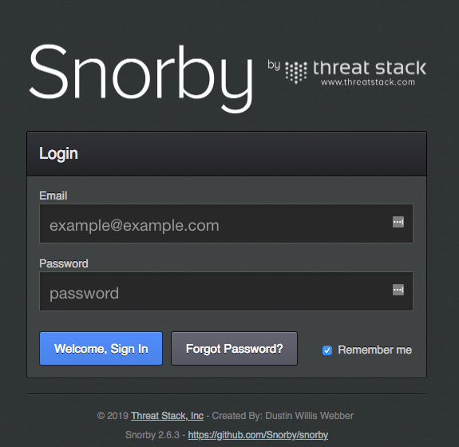
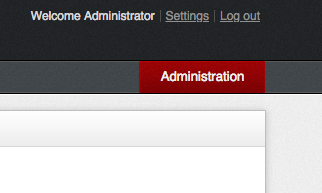

## Passenger-Snorby

This is a Snorby container based on Phusion Passenger and includes some trivial fixes to a no longer actively developed project.

To use this container in your own compose files or orchestration platforms please pull or reference the image on DockerHub.

```
docker pull netsiphon/passenger-snorby
```

### Running Snorby with docker-compose

An example docker-compose file is provided with a single instance of Snorby linked to a MariaDB container. This should be sufficient for most simple use cases.

##### Edit the environment variables

```
vi passenger-snorby.env
```

Please note the following defaults. Generate new passwords for `MYSQL_ROOT_PASSWORD` and `MYSQL_PASSWORD`. Set `DB_PASSWORD` to the same value as `MYSQL_PASSWORD`.  

`SNORBY_PORT`=9443  
`DB_PORT`=3306  
`DB_HOST`=mariadb  
`DB_USER`=snorby  
`DB_PASSWORD`=iSVhVIH3UhK6cwhI/sYKfNR0o01eO3+y5qgO8GbPdlg  
`MYSQL_PASSWORD`=iSVhVIH3UhK6cwhI/sYKfNR0o01eO3+y5qgO8GbPdlg  
`MYSQL_ROOT_PASSWORD`=kyxez/BCKvviZ/ZkYPqZBi7KTtCxZJhXYXtMerwiI7I  
`MYSQL_DATABASE`=snorby  
`MYSQL_USER`=snorby  

##### Create the containers and start them in the background

```
docker-compose up -d
```

If you receive an error upon loading the Snorby web interface for the first time (_ex: We're sorry, but something went wrong._) it's likely that the database creation didn't complete. Down the containers and start them up again.

```
docker-compose down
docker-compose up -d
```
  

Default Snorby username and password for the web interface are
snorby@example.com and __snorby__ so please change them immediately on the settings page.

  

### Suggestions?

 Snorby is not receiving active development so expansive suggestions for work might better be put towards a newer alternative. I don't have plans to continue updating this image with any large changes. Please create issues only for complete non-functionality and small changes.
